# About

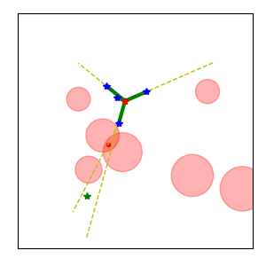

Simple python script to test and visualize different versions [Rapid Random Trees (RRT)](https://en.wikipedia.org/wiki/Rapidly_exploring_random_tree):
 - RRT
 - RRT-March
 - RRT*
 - Informed RRT*

# Usage

## Seed
The seed integer is used a random seed to generate environment and select random samples for planner.   By using same seed value and setting the results from a repeated run should be exactly the same.  This allows examples to run again with same command and get exactly the same results.
```
--seed
```

## Pausing
The simulation runs without stopping until reaching 1000 iterations (default).  It can be useful to have simluation pause running at certain iterations, or after reaching the goal.   When simulation is paused, it can be continued by closing the GUI window.  Multiple pause iterations can be given in single option.  The pause options can also be repeated multiple times.

With following command the simulation will be pause after iterations 1, 2, 3, 10, and 100, as well as when goal is found (assuming it is found)
 ```
./rrt_cmp.py --pause 1 2 3 --pause-at-goal --pause 10 100
 ```

Notes:
 - simulation will exit at last pause value unless pause-at-goal is set and goal has not been found.
 - if pause-at-goal is not set, and not pauses are provided, the simulation will run to 1000 cycles by default

# RRT Varient Examples

## RRT
The basic RRT will randomly select points to expand to.  Those samples will be connected to nearest neighbor to create a connected tree.

### step size
If new sample is farther than a given step size from nearest tree node, the sample distance will be truncated.  Large step sizes mean faster exploration, but a higher chance of collision.

With step size of 0.2 there is more exploration area, but more samples in collision (red-dots), or edges in collision (red-lines)
```
/rrt_cmp.py --seed 16 --fig-size 3 --pause 20 --step-size 0.2
```
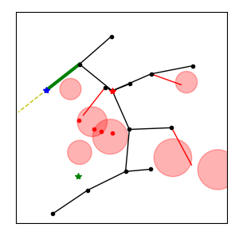

With very small step size of 0.02, there is less exploration but less samples and edges in collision
```
/rrt_cmp.py --seed 16 --fig-size 3 --pause 20 --step-size 0.02
```
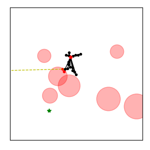

### exploration bias
The exploration bias determines how often the planner picks the goal as sample to connect.

NOTE : For the current RRT implementation there is no goal "tolerance" so the only way to reach the goal point is to pick it as as sample.

A high value in un-cluttered space would help planner reach goal quickly and directly:

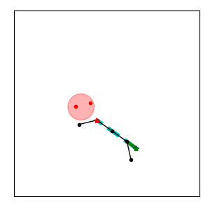
```
./rrt_cmp.py --seed 16 --fig-size 3 --pause-at-goal --obstacle-count 1 --exploration-bias 0.5
```
```
### Iteration 7 ###
  Nodes 6
  Point Collision Checks : 6
  Edge Collision Checks: 11
  Goal Found Iteration: 7
  Goal path length: 0.25922383565860235
  Paused after first reaching goal, close figure to continue running...
```

A high exploration bias that is too high might cause a lot of extra "collisions" states to be expanded towards goal making planner take longer.
```
./rrt_cmp.py --seed 16 --fig-size 3 --pause-at-goal --exploration-bias 0.5
```
```
### Iteration 43 ###
  Nodes 14
  Point Collision Checks : 41
  Edge Collision Checks: 32
  Goal Found Iteration: 43
  Goal path length: 0.5895572917945114
  Paused after first reaching goal, close figure to continue running...
```

For a 90% value, the planner takes 132 iterations to reach goal versus 43 for a 50% value.   Deafult value is 10%.
```
./rrt_cmp.py --seed 16 --fig-size 3 --pause-at-goal --exploration-bias 0.9
```
```
### Iteration 132 ###
  Nodes 14
  Point Collision Checks : 129
  Edge Collision Checks: 40
  Goal Found Iteration: 132
  Goal path length: 0.5547459641988138
  Paused after first reaching goal, close figure to continue running...
```


## RRT-March
With RRT-March the planner with keep taking steps in same direction of sample until it is reached or a collision occurs.  The planner basically keeps "Marching" in same direction, versus changing directions after each sample.

To make difference of RRT and RRT-March more obvious, a very small step-size is used

**With March**
```
./rrt_cmp.py --seed 21 --fig-size 3 --pause 10 100 --step-size 0.02 --march
```
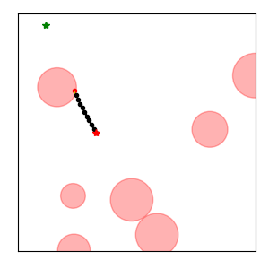

**Without March**
```
./rrt_cmp.py --seed 21 --fig-size 3 --pause 10 100 --step-size 0.02
```
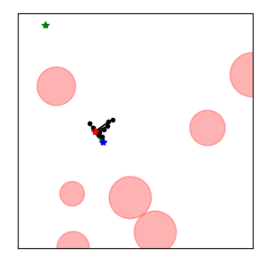


**100 Iterations**
This is what two options looks like after 100 iterations

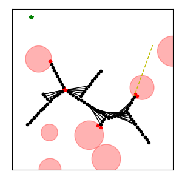
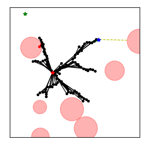


## RRT* (RRT-Star)

With RRT-Star the alogrith will "re-wire" edges in order to shorten edge lengths.   This re-wiring is done in a "neighborhood" of each new sample.

### Re-wiring new sample
With plain RRR, when a new sample is chosen it is  connected to **closest** node.  Hoever, the closest node might not have the shortest path near back to start point.  With RRT* the new sample is connected to a the **nearby** node that would create shortest effect path from start to new node.

In the following the newly sampled point (blue star) is connected to an early tree node (thick green line) instead of closest node (dashed red-line).  This is done because alternate path would have a shorter path from start to new node.
```
./rrt_cmp.py --seed 21 --fig-size 3 --pause 20 --neighborhood 0.15
```
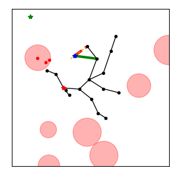

### Re-wiring of neighbors
RRT-Star will also connect any neighbors to new sample if it happends to shorted the path distance from the neighbors to the new sample.

```
./rrt_cmp.py --seed 21 --fig-size 3 --pause 13 14 --neighborhood 0.15
```

This shows tree in iteration just before neighbors are re-wired

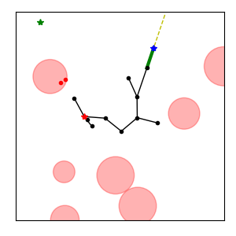

This show tree after a new samplre re-wires neighbors

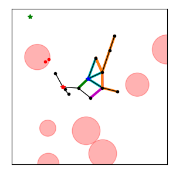
- Green line : new edge to new sample
- Cyan lines : edges that were re-wired to new sample
- Magenta line : origin removed edges of re-wired neighbors
- Orange lines : downstream edges that had their cost reduced because of re-wiring


## Informed RRT*
With informed RRT* the sampling changes after a path a to the goal is found.  
Once a path to the goal is found, new samples are only placed in locations that
could potentially reduce the path length to the goal.

Assume the start is S, and goal is G, and the new sample point is P.
The lenght L shortest possible path from start to goal that goes through P is:
```
L = dist(S,P) + dist(P,G) 
```

If L is larger than the current shorest path from the start to the goal, 
than sampling P could never improve the tree in a way to provide a shorter path to the goal.

The above formula defines an elipse with the start and goal as focal point.
When sampling is done, only new samples from inside the elipse are used.
As the path from the start to the goal shrinks, so does the elipse.

This helps concentrate the computational effort, and should provide faster improvement
of path length that placing new samples anywere in collision-free space.

In following example, informed RRT is used.  The red dashed outline shows the current elipse limits
for new samples.

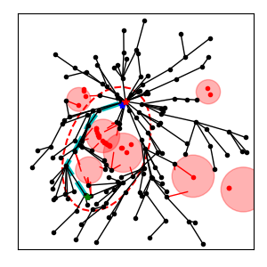
```
./rrt_cmp.py --seed 16 --fig-size 3 --pause 200 --neighborhood 0.15 --informed
```
```
### Iteration 200 ###
  Nodes 150
  Point Collision Checks : 66
  Edge Collision Checks: 1727
  Goal Found Iteration: 88
  Goal path length: 0.5509395961450225
  Paused at 200 close figure to continue...
```

For comparison, this below is what occurs when informed sampling is not used.  
After 200 iterations, the samples are more spread out and the path to goal cost is about 20% higher.

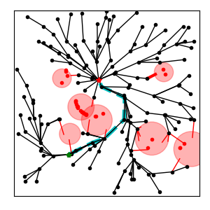
```
./rrt_cmp.py --seed 16 --fig-size 3 --pause 200 --neighborhood 0.15
```
```
### Iteration 200 ###
  Nodes 154
  Point Collision Checks : 74
  Edge Collision Checks: 1163
  Goal Found Iteration: 88
  Goal path length: 0.6537540129442878
  Paused at 200 close figure to continue...
```